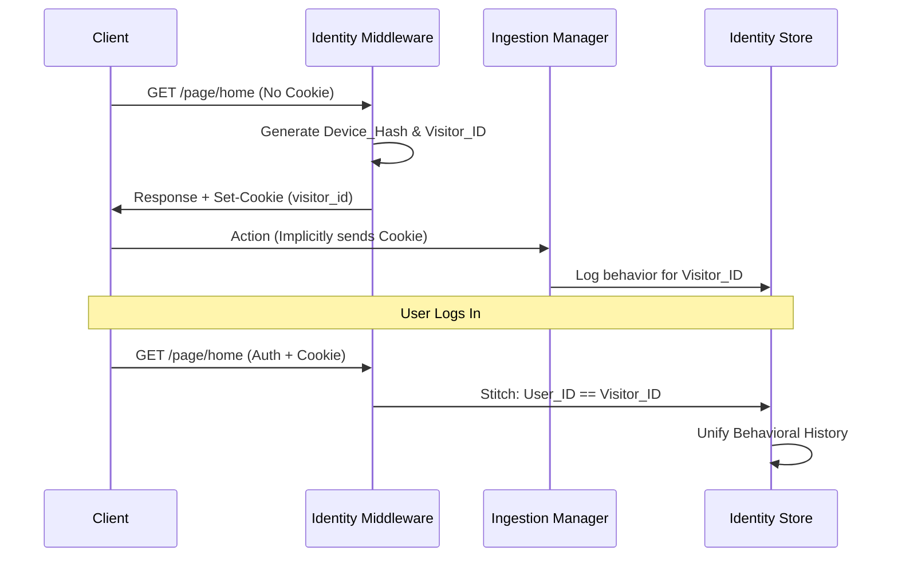

# 👤 Identity & Context: Zero-Touch Persistence

[🏠 Hub](../HUB.md) | [🏗️ Architecture](./SYMPHONY.md) | [⚡ Streaming](./ORCHESTRATION.md) | [🎨 Pages](./PAGES.md)

---

## 🎯 The Goal: Seamless Personalization

Bongas-AI provides world-class personalization without "Frontend Backlash." Our identity system is **Zero-Touch** for client developers. The backend autonomously handles device recognition, persistence, and identity stitching.

## 🎭 Identity Tiers

| Tier | Identification | Persistence | Personalization Level |
| :--- | :--- | :--- | :--- |
| **Anonymous** | `device_hash` (IP + UA) | Request-based | Contextual (Device + Time) |
| **Visitor** | `visitor_id` (Transparent Cookie) | 1 Year (Persistent) | Behavioral (Device History) |
| **User** | `user_id` (JWT / Auth Profile) | Account-based | Fully Personalized |

## 🧶 The Identity "Stitch"

Our `identity_middleware` acts as a silent observer that links anonymous behavior to persistent profiles:

1.  **Fingerprinting**: Every request is assigned a `device_hash` derived from the IP address and User-Agent. This allows us to recognize a "Living Room TV" even if cookies are disabled.
2.  **Zero-Touch Cookie**: On the first request, the server issues a `Set-Cookie: visitor_id=UUID`. Most modern HTTP clients store this automatically.
3.  **Context Injection**: These identifiers are injected into the `IdentityContext` extension and merged into `ContextParams`, making them available to every ML model in the engine.

## 🛠️ Technical Implementation

- **Location**: `src/api/middleware/identity.rs`
- **Logic**: Uses SHA-256 for deterministic `device_hash` generation.
- **Persistence**: Employs `HttpOnly`, `SameSite=Lax` cookies with a 1-year expiration (`Max-Age=31536000`).

---

## 🚀 Next Steps

- Explore the [**Streaming Orchestration**](./ORCHESTRATION.md) model.
- See how [**Smart Pages**](./PAGES.md) use this identity data.

---

[🏠 Hub](../HUB.md) | [🔝 Top](#-identity--context-zero-touch-persistence)
