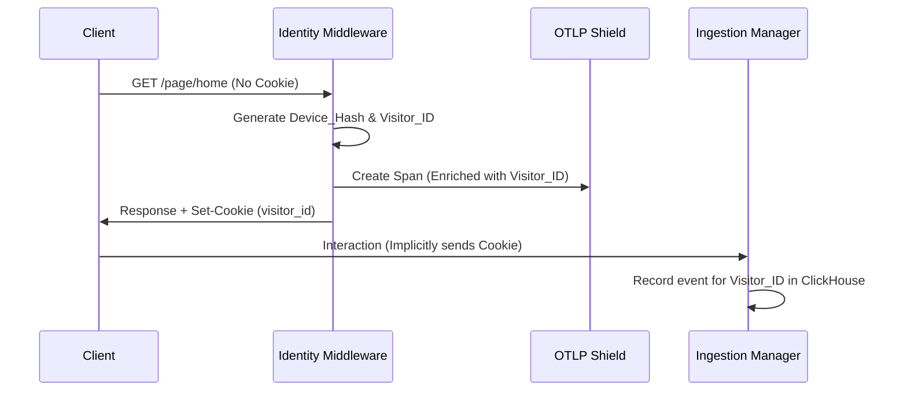

# 👤 Identity & Context: Zero-Touch Intelligence 2.0

[🏠 Hub](../HUB.md) | [🏗️ Architecture](./SYMPHONY.md) | [⚡ Streaming](./ORCHESTRATION.md) | [🎨 Pages](./PAGES.md)

---

## 🎯 The Goal: Frictionless Intelligence

Bongas-AI provides world-class personalization without requiring complex frontend state management. Our identity system is **Zero-Touch**: the backend autonomously handles device recognition, persistence, identity stitching, and distributed tracing.

## 🎭 Identity Tiers

| Tier | Identification | Persistence | Personalization Level |
| :--- | :--- | :--- | :--- |
| **Anonymous** | `device_hash` (IP + UA) | Request-based | Contextual (Device + Time) |
| **Visitor** | `visitor_id` (Transparent Cookie) | 1 Year (Persistent) | Behavioral (Device History) |
| **Profile** | `profile_id` (JWT / Sub-Account) | Persona-based | Niche (Kid vs Adult) |
| **User** | `user_id` (Auth Account) | Account-based | Fully Personalized |

## 🧶 The Identity "Stitch" & Propagation

Our `identity_middleware` acts as a silent observer that links anonymous behavior to persistent profiles while ensuring end-to-end observability.

### 1. Zero-Touch Device Detection

If the `X-Device-Type` header is missing, the middleware parses the `User-Agent` to categorize the device:

- **TV:** Smart TVs, AppleTV, GoogleTV.
- **Mobile:** iPhones, Android phones.
- **Tablet:** iPads, Playbooks.
- **Web:** Desktop browsers.

### 2. OTLP Shield (Tracing)

Every request participates in a distributed trace.

- **Extraction:** Captures `traceparent` headers from upstream gateways.
- **Enrichment:** The active span is automatically enriched with `visitor_id`, `device_hash`, and `profile_id`.
- **Propagation:** These IDs follow the request as it fans out into concurrent scenarios.

### 3. Identity Stitching

The moment a `visitor_id` authenticates with a `user_id` or `profile_id`, the `IdentityStitcher` (in `IntelligencePillar`) retroactively merges their anonymous behavioral history into their persistent profile.

## 🛠️ Technical Implementation

- **Middleware**: `src/api/middleware/identity/service.rs`
- **Tracing**: Uses `tracing-opentelemetry` and `opentelemetry-http` for header extraction.
- **Persistence**: Employs `HttpOnly`, `SameSite=Lax` cookies with a 1-year expiration.

---

## 🚀 Next Steps

- Explore the [**Velocity Engine**](./ORCHESTRATION.md) parallel model.
- See how [**Smart Pages**](./PAGES.md) use this identity data for row ranking.

---

[🏠 Hub](../HUB.md) | [🔝 Top](#-identity--context-zero-touch-intelligence-20)
