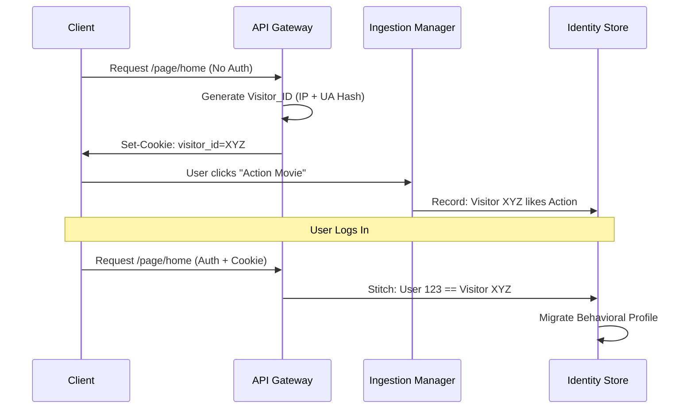

# 👤 Identity & Context: Zero-Touch Persistence

[🏠 Hub](../HUB.md) | [🏗️ Architecture](./SYMPHONY.md) | [⚡ Streaming](./ORCHESTRATION.md) | [🎨 Pages](./PAGES.md)

---

## 🎯 The Goal: Seamless Personalization

Bongas-AI aims to provide world-class personalization without "Frontend Backlash." Our identity system is designed to be **Zero-Touch** for client developers while providing **Deep Insight** for the recommendation engine.

## 🎭 Identity Tiers

| Tier | Identification | Persistence | Personalization Level |
| :--- | :--- | :--- | :--- |
| **Anonymous** | IP + User-Agent Hash | Session-based | Contextual (Device + Time) |
| **Visitor** | Transparent HTTP Cookie | Long-term | Behavioral (Device History) |
| **User** | JWT Token / Auth Profile | Global | Fully Personalized |

## 🧶 Identity Stitching

How we link an anonymous device to a logged-in user without manual effort:

## 🛡️ Zero-Touch Implementation

1. **Context Extractor (Middleware)**: Every request passes through a Rust middleware that extracts the `visitor_id` from cookies or hashes the IP/UA.
2. **Context Propagation**: This ID is injected into the `ContextParams` and passed down to every Scenario and ML model.
3. **Cross-Device Signals**: Even if User 123 logs out, the system remembers that *this specific TV* (Visitor XYZ) usually watches Kids' content in the morning.

---

## 🚀 Next Steps

- Explore the [**Streaming Orchestration**](./ORCHESTRATION.md) model.
- See how [**Smart Pages**](./PAGES.md) use this identity data.

---

[🏠 Hub](../HUB.md) | [🔝 Top](#-identity--context-zero-touch-persistence)
