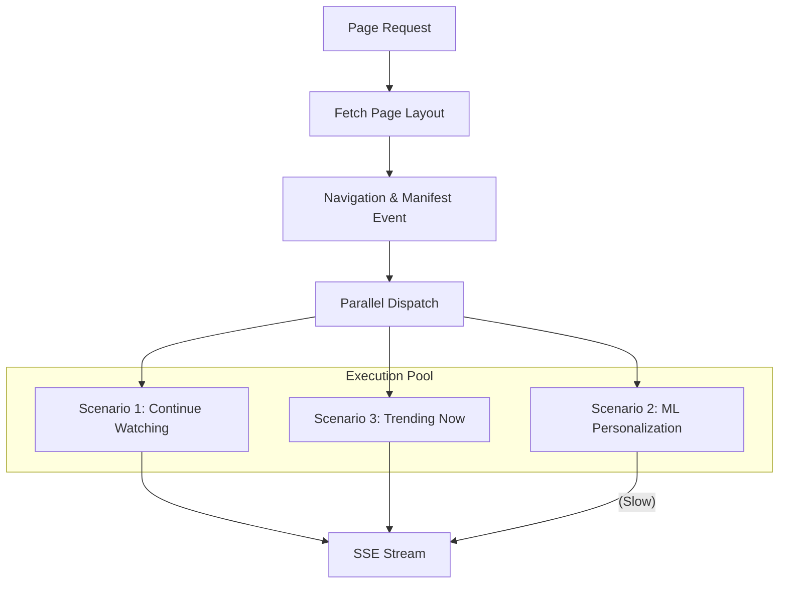

# ⚡ Streaming & Orchestration: The Velocity Engine

[🏠 Hub](../HUB.md) | [🏗️ Architecture](./SYMPHONY.md) | [👤 Identity](./IDENTITY.md) | [🎨 Pages](./PAGES.md)

---

## 🏎️ The Goal: Zero Perceived Latency

A world-class recommendation engine cannot wait for its slowest model. Bongas-AI uses **Parallel Pipelined Execution** to ensure that the user sees content as fast as the fastest component can deliver it.

## 🔄 Execution Models: Sequential vs. Parallel

### The Legacy Way (Sequential)

Each row waits for the previous one. A single slow ML model blocks the entire page.

- **Total Time:** Row 1 + Row 2 + Row 3...
- **User Experience:** "Stuttering" load.

### The Bongas-AI Way (Parallel Pipelined)

We trigger all rows simultaneously and stream them in a buffered order.

- **Total Time:** Max(Fastest Rows) + Overhead.
- **User Experience:** "Instant-On" pop.

## 🛠️ The "Velocity" Contract

1. **The Manifest Event**: The first event in the SSE stream tells the client exactly how many rows to expect and which rows to **pre-warm**.
2. **Buffer Unordered**: We execute scenarios in parallel (Concurrency: 5).
3. **Ordered Streaming**: While execution is parallel, we maintain a logical "order of importance" where possible, but never allow one slow row to kill the stream.
4. **Graceful Degradation**: If a scenario exceeds its timeout, the orchestrator emits an **Empty Comment** or a **Fallback Event** (e.g., "Popular") so the UI stays intact.

## 🛡️ The Shield: Resilience & Scale

To ensure "Netflix-Grade" reliability, Bongas-AI implements three layers of protection:

### 1. Fallback Scenarios (Fail-Over)
Admins can configure a `fallback_slug` for every row. If the primary (personalized) scenario fails, the engine automatically swaps it for a generic, high-performance alternative (e.g., "Trending").

### 2. Adaptive Rate Limiting
The SSE pool is protected by a visitor-level concurrency tracker. Each `visitor_id` is limited to **3 concurrent connections**, preventing device malfunctions or bot attacks from exhausting server resources.

### 3. Predictive Warming (Scroll Depth)
The `manifest` event contains a `prewarm_scenarios` hint. As the user scrolls, the client can call the `/prewarm` endpoint to trigger background execution for future rows, ensuring they are already cached when the user reaches them.

---

## 🚀 Next Steps

- Learn how [**Smart Pages**](./PAGES.md) define these layouts.
- View the [**API Reference contract**](../api/REFERENCE.md).

---

[🏠 Hub](../HUB.md) | [🔝 Top](#-streaming--orchestration-the-velocity-engine)
