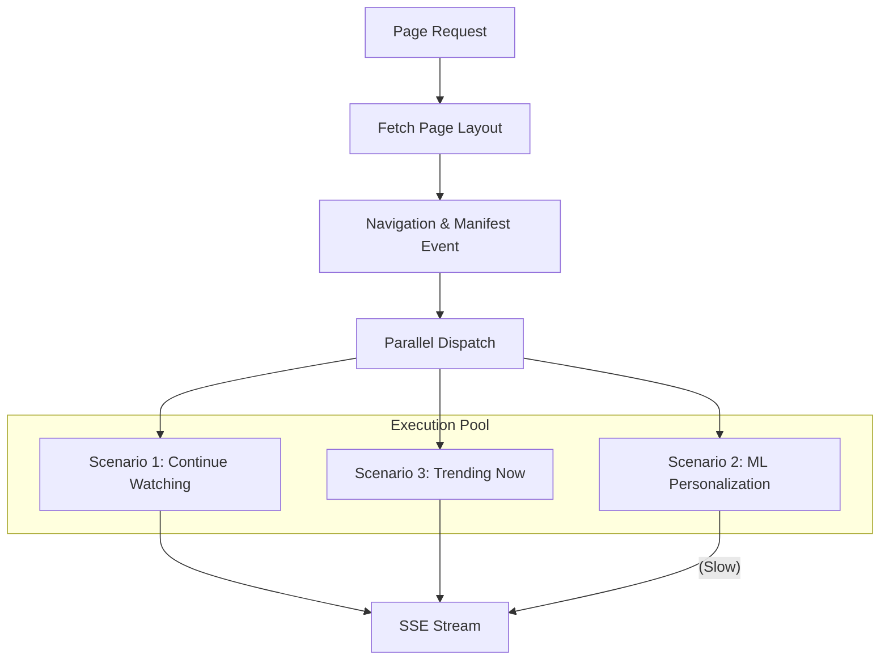

# ⚡ Streaming & Orchestration: The Velocity Engine

[🏠 Hub](../HUB.md) | [🏗️ Architecture](./SYMPHONY.md) | [👤 Identity](./IDENTITY.md) | [🎨 Pages](./PAGES.md)

---

## 🏎️ The Goal: Zero Perceived Latency

A world-class recommendation engine cannot wait for its slowest model. Bongas-AI uses **Parallel Pipelined Execution** to ensure that the user sees content as fast as the fastest component can deliver it.

## 🔄 Execution Models: Sequential vs. Parallel

### The Legacy Way (Sequential)

Each row waits for the previous one. A single slow ML model blocks the entire page.

- **Total Time:** Row 1 + Row 2 + Row 3...
- **User Experience:** "Stuttering" load.

### The Bongas-AI Way (Parallel Pipelined)

We trigger all rows simultaneously and stream them in a buffered order.

- **Total Time:** Max(Fastest Rows) + Overhead.
- **User Experience:** "Instant-On" pop.

## 🛠️ The "Velocity" Contract

1. **The Manifest Event**: The first event in the SSE stream tells the client exactly how many rows to expect.
2. **Buffer Unordered**: We execute scenarios in parallel.
3. **Ordered Streaming**: While execution is parallel, we maintain a logical "order of importance" where possible, but never allow one slow row to kill the stream.
4. **Graceful Degradation**: If a scenario exceeds its timeout, the orchestrator emits an **Empty Comment** or a **Fallback Event** (e.g., "Popular") so the UI stays intact.

## 💓 Heartbeats & Resilience

- **Keep-Alive**: A 15-second heartbeat ensures load balancers don't drop the connection during heavy computation.
- **Fault-Tolerance**: Every individual scenario is wrapped in a `catch_all` block. One failing model cannot crash the page.

---

## 🚀 Next Steps

- Learn how [**Smart Pages**](./PAGES.md) define these layouts.
- View the [**API Reference contract**](../api/REFERENCE.md).

---

[🏠 Hub](../HUB.md) | [🔝 Top](#-streaming--orchestration-the-velocity-engine)
