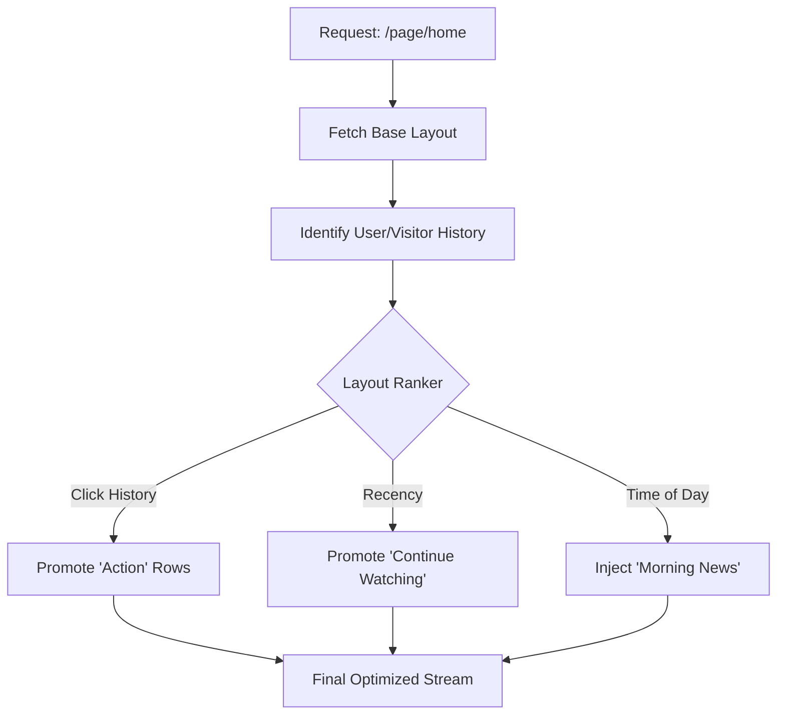

# 🎨 Smart Pages: The SDUI Canvas & Brain

[🏠 Hub](../HUB.md) | [🏗️ Architecture](./SYMPHONY.md) | [👤 Identity](./IDENTITY.md) | [⚡ Streaming](./ORCHESTRATION.md)

---

## 🏛️ The Philosophy: Living Layouts

A "Page" in Bongas-AI is no longer a static list of items. It is a **Dynamic Blueprint** that adapts in real-time. Instead of hardcoding what a user sees, admins define **Rules** and **Pools** of content that the engine resolves and optimizes based on user engagement.

## 📐 The Layout Contract

Every page layout in Bongas-AI is defined by a structured **Composition**.

### 1. Targeting Rules

The engine uses a **Contextual Resolver** to pick the best layout for a request:
- **`device_type`**: Optimize for `mobile`, `tv`, `web`, or `tablet`.
- **`maturity_rating`**: Filter content for `GE`, `PG`, `12`, `15`, or `18`.
- **`priority`**: When multiple layouts match, the one with the highest priority wins.

### 2. Composition (SDUI)

Each row in a layout is a `PageCompositionItem` containing:
- **`slug`**: The engine scenario to execute (e.g., `trending_now`).
- **`row_type`**: The UI component type (e.g., `hero_carousel`, `horizontal_list`).
- **`row_style`**: Visual hints (e.g., `promotional`, `compact`, `tall_cards`).

## 🧠 The Brain: Algorithmic Reordering

Beyond manual admin ordering, Bongas-AI implements **Personalized Layouts**. The engine "learns" from every interaction to promote high-engagement content.

### The Feedback Loop

The **Ingestion Manager** streams processed activities back to the **PagesManager**, which maintains real-time engagement scores:

- **Click**: +1.0 Score
- **Playback**: +0.0 to +1.0 (based on watch percentage)
- **Like**: +2.0 Score
- **Impression (Ignored)**: -0.05 (Slight decay)

### Sorting Logic

When a user requests a page, the engine fetches the base layout and then performs a **stable sort** of the composition based on the user's specific engagement scores. This ensures that "Continue Watching" or "Favorite Genres" automatically bubble to the top if the user interacts with them frequently.

---

## 🚀 Next Steps

- View the [**API Reference contract**](../api/REFERENCE.md).
- Return to the [**Documentation Hub**](../HUB.md).

---

[🏠 Hub](../HUB.md) | [🔝 Top](#-smart-pages-the-sdui-canvas--brain)
