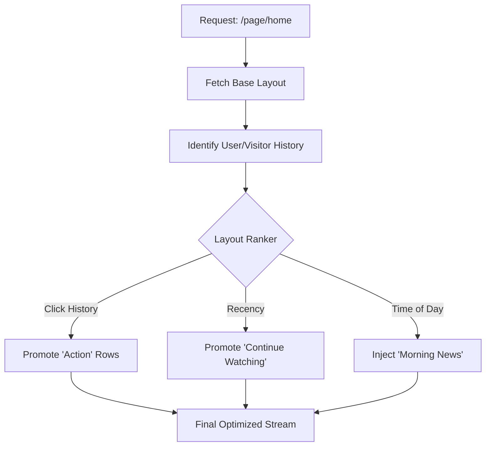

# 🎨 Smart Pages: The SDUI Canvas

[🏠 Hub](../HUB.md) | [🏗️ Architecture](./SYMPHONY.md) | [👤 Identity](./IDENTITY.md) | [⚡ Streaming](./ORCHESTRATION.md)

---

## 🏛️ The Philosophy: Living Layouts

A "Page" in Bongas-AI is not a static list of items. It is a **Dynamic Blueprint** that adapts in real-time. Instead of hardcoding what a user sees, admins define **Rules** and **Pools** of content.

## 📐 The Layout Contract

Every page layout in Bongas-AI contains:

- **Targeting Rules**: Which device, region, or user cohort is this layout for?
- **Composition**: A list of `Scenario Slugs` or `Dynamic Slots`.
- **Presentation Directives**: Should this row be a `Horizontal List`, `Hero Banner`, or `Grid`?

## 🧠 Intelligence: Algorithmic Reordering

Beyond manual admin ordering, Bongas-AI supports **Personalized Layouts**.

## 📺 Server-Driven UI (SDUI)

The backend dictates the **Visual Presentation**. The client receives a `row_type` and maps it to a UI component.

| Row Type | Client Component | Best For |
| :--- | :--- | :--- |
| `hero_carousel` | `HeroSlider` | Big promotional items at the top. |
| `horizontal_list` | `HorizontalScroll` | Standard browsing rows. |
| `feature_grid` | `Grid` | Category pages or large collections. |
| `billboard` | `StaticImage` | Static ads or announcements. |

## 🛠️ Why This Matters

- **Zero Releases**: Change your entire app's look and feel from the database.
- **A/B Testing**: Run experiments on the *order* of rows, not just the content inside them.
- **Device Optimization**: Send a dense layout to Web and a high-visual layout to TV.

---

## 🚀 Next Steps

- View the [**API Reference contract**](../api/REFERENCE.md).
- Return to the [**Documentation Hub**](../HUB.md).

---

[🏠 Hub](../HUB.md) | [🔝 Top](#-smart-pages-the-sdui-canvas)
