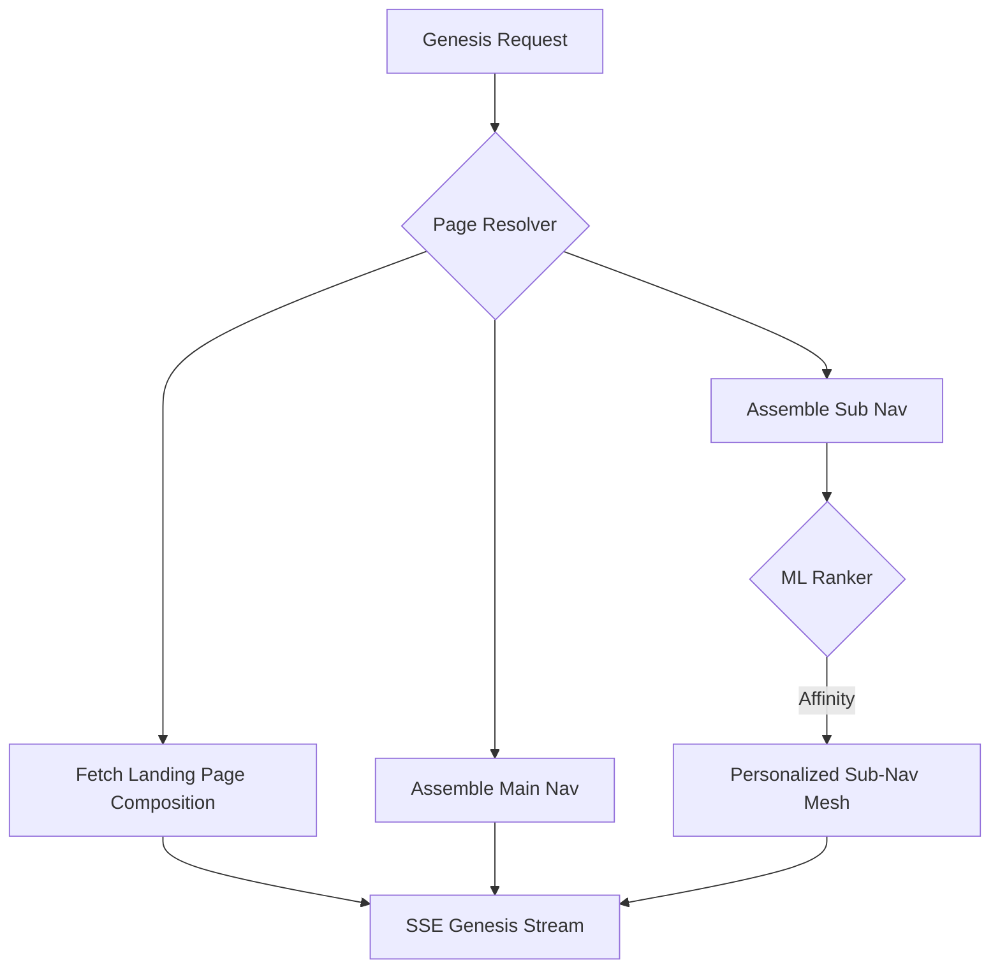

# 🎨 Smart Pages: The SDUI Canvas & Brain

[🏠 Hub](../HUB.md) | [🏗️ Architecture](./SYMPHONY.md) | [👤 Identity](./IDENTITY.md) | [⚡ Streaming](./ORCHESTRATION.md)

---

## 🏛️ The Philosophy: Living Layouts

A "Page" in Bongas-AI is a **Dynamic Blueprint** that adapts in real-time. Instead of hardcoding what a user sees, admins define **Rules** and **Pools** of content that the engine resolves and optimizes based on user engagement and device context.

## 📐 The Navigation Mesh

The engine assembles a personalized application structure every time a user connects to the root endpoint (`GET /api/v1/recommendation`).

### 1. The Landing Page (Singleton)

Admins can flag layouts as `is_landing = true`. The engine enforces a **Singleton Constraint** per (Device, Maturity).

- **Resolver**: Finds the single entry point for the user's specific context.
- **Fall-Over**: If no specific landing page exists, it uses the global `all`-category default.

### 2. Navigation Hierarchy

Pages are categorized into three types:

- **Main**: Global top-level pages (e.g., Home, Live TV, Movies).
- **Sub**: Contextual hubs (e.g., "Free for You", "Action Universe"). These are **ML-Ranked** based on user affinity.
- **Hidden**: Accessible only via deep-link or specific buttons (e.g., "Privacy Policy").

## 🧠 The Brain: Algorithmic Reordering

Beyond manual admin ordering, Bongas-AI implements **Personalized Layouts**. The engine "learns" from every interaction to promote high-engagement content.

### The Feedback Loop

The **Ingestion Manager** streams processed activities back to the **PagesManager**, which maintains real-time engagement scores per `visitor_id`.

### Sorting Logic

When a user requests a page, the engine performs a **stable sort** of the composition based on the user's specific engagement scores. High-engagement scenarios (like "Recently Watched") automatically bubble to the top.

## 📺 Presentation Directives (SDUI)

| Row Type | Client Component | Best For |
| :--- | :--- | :--- |
| `hero_carousel` | `HeroSlider` | Big promotional items at the top. |
| `horizontal_list` | `HorizontalScroll` | Standard browsing rows. |
| `feature_grid` | `Grid` | Category pages or large collections. |
| `billboard` | `StaticImage` | Static ads or announcements. |

---

## 🚀 Next Steps

- View the [**API Reference contract**](../api/REFERENCE.md).
- Return to the [**Documentation Hub**](../HUB.md).

---

[🏠 Hub](../HUB.md) | [🔝 Top](#-smart-pages-the-sdui-canvas--brain)
