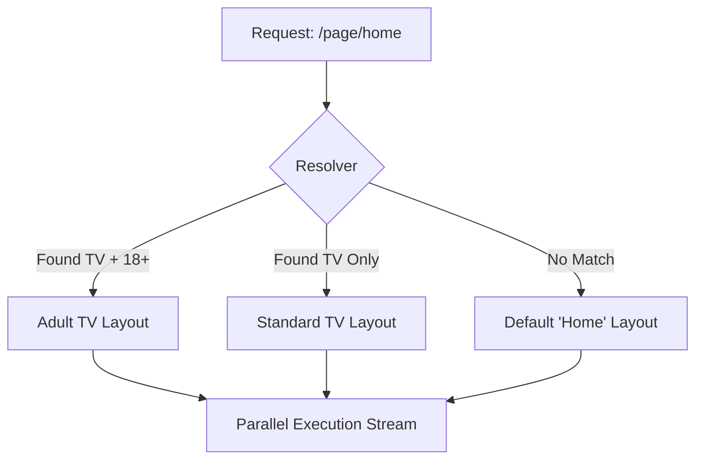

# 🎨 Smart Pages: The SDUI Canvas

[🏠 Hub](../HUB.md) | [🏗️ Architecture](./SYMPHONY.md) | [👤 Identity](./IDENTITY.md) | [⚡ Streaming](./ORCHESTRATION.md)

---

## 🏛️ The Philosophy: Living Layouts

A "Page" in Bongas-AI is no longer a static list of items. It is a **Dynamic Blueprint** that adapts in real-time. Instead of hardcoding what a user sees, admins define **Rules** and **Pools** of content that the engine resolves based on the user's environment.

## 📐 The Layout Contract

Every page layout in Bongas-AI is defined by a structured **Composition**.

### 1. Targeting Rules

The engine uses a **Contextual Resolver** to pick the best layout for a request:
- **`device_type`**: Optimize for `mobile`, `tv`, `web`, or `tablet`.
- **`maturity_rating`**: Filter content for `G`, `PG`, `13+`, or `18+`.
- **`priority`**: When multiple layouts match, the one with the highest priority wins.

### 2. Composition (SDUI)

Each row in a layout is a `PageCompositionItem` containing:
- **`slug`**: The engine scenario to execute (e.g., `trending_now`).
- **`row_type`**: The UI component type (e.g., `hero_carousel`, `horizontal_list`).
- **`row_style`**: Visual hints (e.g., `promotional`, `compact`, `tall_cards`).

## 🧠 The Resolution Logic

When a request for `/page/home` arrives, the `PagesManager` performs a hierarchical search:

1.  **Exact Match**: `slug` + `device` + `maturity`.
2.  **Platform Match**: `slug` + `device` (for all ages).
3.  **Default Layout**: `slug` + `default` device.

## 📺 Presentation Directives

The backend dictates the **Visual Presentation**. The client receives a `row_type` and maps it to a native UI component.

| Row Type | Client Component | Best For |
| :--- | :--- | :--- |
| `hero_carousel` | `HeroSlider` | Big promotional items at the top. |
| `horizontal_list` | `HorizontalScroll` | Standard browsing rows. |
| `feature_grid` | `Grid` | Category pages or large collections. |
| `billboard` | `StaticImage` | Static ads or announcements. |

---

## 🚀 Next Steps

- View the [**API Reference contract**](../api/REFERENCE.md).
- Return to the [**Documentation Hub**](../HUB.md).

---

[🏠 Hub](../HUB.md) | [🔝 Top](#-smart-pages-the-sdui-canvas)
