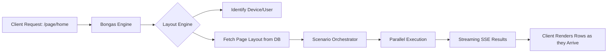

# 🏗️ The Bongas-AI Symphony: Core Architecture

[🏠 Hub](../HUB.md) | [👤 Identity](./IDENTITY.md) | [⚡ Streaming](./ORCHESTRATION.md) | [🎨 Pages](./PAGES.md)

---

## 🎼 The Paradigm: Server-Driven UI (SDUI)

In a traditional API architecture, the client (Mobile/Web) is "smart"—it knows exactly which endpoints to call and how to arrange the data. This creates **rigidity**: updating the UI requires an app store release.

**Bongas-AI flips the script.** The server is the Orchestrator, and the client is the Canvas.

## 🌟 Key Architectural Pillars

### 1. Context-Aware Composition

Bongas-AI doesn't just return data; it returns a **Composition**. Every response is tailored to the context:

- **Who is watching?** (Identity & Profile)
- **Where are they?** (Geolocation/Region)
- **What are they using?** (Device Type: TV, Mobile, Tablet)
- **What time is it?** (Temporal Relevance: Breakfast News vs. Late Night Horror)

### 2. The Streaming State Machine

By leveraging Server-Sent Events (SSE) and Rust's `futures` ecosystem, we deliver content as a **continuous flow**.

- **Event: `navigation`**: Sent instantly to render the app's top-level structure.
- **Event: `manifest`**: Sent early to allow the frontend to render "Skeleton UI" loaders.
- **Event: `row`**: Individual content rows (Horizontals, Grids, Heros) stream in as they are processed.

### 3. Zero-Touch Persistence

We recognize users and devices without requiring intrusive tracking or complex frontend state management. Through smart fingerprinting and cookie-lite strategies, we build a behavioral profile for every "Visitor ID" before they even log in.

---

## 🚀 Next Steps

- Learn about our [**Identity Stitching**](./IDENTITY.md).
- Explore the [**Parallel Pipelined Streaming**](./ORCHESTRATION.md) model.

---

[🏠 Hub](../HUB.md) | [🔝 Top](#️-the-bongas-ai-symphony-core-architecture)
