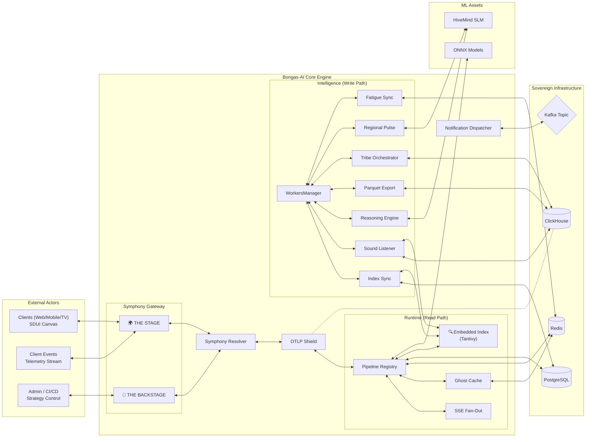

# 🏗️ The Bongas-AI Symphony 2.0: Core Architecture

[🏠 Hub](../HUB.md) | [👤 Identity](./IDENTITY.md) | [⚡ Streaming](./ORCHESTRATION.md) | [🎨 Pages](./PAGES.md) | [🔒 Security](./SECURITY.md)

---

## 🎼 The Paradigm: Server-Side Anticipatory Engine

In Symphony 2.0, we have evolved beyond simple Server-Driven UI (SDUI). Bongas-AI is now an **Anticipatory Engine** that minimizes user-perceived latency through server-side look-ahead and parallel fan-out.

**Bongas-AI flips the script.** The server is the Orchestrator, and the client is the Canvas.

👉 **[View the Interactive Data-Flow Architecture Diagram](./SYMPHONY_INTERACTIVE_DIAGRAM.html)**
> ⚠️ **GitLab/GitHub Notice:** By default, repository platforms render `.html` files as raw source code for security reasons. To view the animations and interactive elements, please **download** the `SYMPHONY_INTERACTIVE_DIAGRAM.html` file to your computer and open it in your web browser.

## 🌟 Key Architectural Pillars

### 1. Velocity Engine (Parallel Fan-Out)

Symphony 2.0 eliminates sequential bottlenecks. Using Rust's `futures` ecosystem, we execute up to 5 scenarios simultaneously per request.

- **Ordered Pipelining:** Uses `.buffered(5)` for SSE to maintain UI layout integrity.
- **Unordered Ghosting:** Uses `.buffer_unordered(5)` for background pre-warming to maximize throughput.

### 2. Sovereign Search & Deep Content (Milestone 20)

Unlike standard engines that rely on external search servers, Bongas-AI embeds its search logic directly into the core binary using **Tantivy**.

- **Embedded Indexing**: Zero network latency; search results are retrieved directly from memory-mapped disk files.
- **Sound Listener Intelligence**: A specialized worker extracts spoken words from video DNA, enabling users to search for content by what was *said*, not just the title.
- **Sheng-Native Analysis**: Customized linguistic tokenization using `jieba-rs` to correctly index and match Swahili and Sheng dialects.
- **Relevance Fusion**: Hybrid ranking that fuses BM25 keyword matching with Vision DNA vector similarity and real-time user history.

### 3. The OTLP Shield (High-Performance Observability)

Every request is protected and tracked by a "Shield" of distributed tracing, optimized for high throughput.

- **Trace ID Propagation**: Follows a request from the initial HTTP header, through the SSE fan-out, down to Postgres and Redis.
- **Identity Enrichment**: Spans are automatically enriched with `visitor_id`, `device_hash`, and `profile_id`.
- **Netflix-Scale Batching**: Telemetry is buffered and exported in configurable batches (`batch_size`, `max_queue_size`) to minimize the impact on the engine's performance.

### 4. Intelligence & Background Coordination (The Pulse)

The engine's "Intelligence" is not just reactive; it is proactive. Background workers constantly refine the data used by the discovery pipeline.

- **WorkersManager**: Centralized orchestration for all background maintenance tasks and intelligence workers.
- **Behavioral Tribes (TribeOrchestrator)**: Periodically clusters user profiles into behavioral "tribes" using K-Means clustering on embeddings.
- **Hyper-Local Semantic Pulse (RegionalPulseWorker)**: Scrapes regional news and events, classifying them via the HiveMind LLM to provide real-time semantic boosts.
- **Predictive Warming**: Anticipates high-traffic scenarios and pre-warm the cache tiers to ensure zero-latency delivery during peak loads.

### 5. Server-Side Look-Ahead (Ghost Execution)

We eliminate client-side complex pre-warming logic. The engine automatically anticipates the user's next scroll based on `prewarm_lookahead` configuration and executes the next batch of rows in the background, caching them in Redis for zero-latency fetch.

### 6. Zero-Touch Contextual Identity

We recognize devices and users passively to ensure privacy-first tracking.

- **Device Hash:** Deterministic fingerprinting using IP and User-Agent.
- **Visitor ID:** Transparent persistence via "Cookie-Lite" (Zero-Touch).
- **Identity Stitching:** Automatic merging of anonymous behavior into authenticated profiles upon login.

### 7. Blackbox Sovereign Intelligence (Data Sovereignty vs IP)

To ensure **Data Sovereignty** without sacrificing **IP Protection**, Bongas-AI utilizes a bifurcated "Sovereign Intelligence" approach:

- **Frozen Senses:** Massive foundation models (`sight-core`, `slm-base`) are deployed locally as read-only assets to extract semantic DNA without sending client content to the cloud.
- **Local Cython Trainer:** An obfuscated Python backend (`trainer.so`) trains fast, lightweight "Student Heads" (`vision_head.onnx`, `slm_head.onnx`, `ranking.onnx`) directly on the client's private ClickHouse interaction data.
- **Sidecar Execution:** The Rust engine uses background workers (e.g., `SovereignSightWorker`, `SoundListenerWorker`) to asynchronously run heavy feature extraction, ensuring sub-millisecond API responsiveness.

---

## 🚀 Architectural Deep-Dives

- **[👤 Identity & Stitching](./IDENTITY.md)**: How we track users without logins.
- **[⚡ Velocity Orchestration](./ORCHESTRATION.md)**: Parallel pipelining and Ghost execution logic.
- **[🎨 Page Composition](./PAGES.md)**: Smart layouts, SDUI metadata, and algorithmic ranking.
- **[🛡️ Resilience & Scale](./SECURITY.md)**: Circuit breakers, high-limit pools, and OTLP.
- **[🔍 Embedded Search](../../src/search/README.md)**: The internal mechanics of the Tantivy search pillar.

---

[🏠 Hub](../HUB.md) | [🔝 Top](#️-the-bongas-ai-symphony-20-core-architecture)
