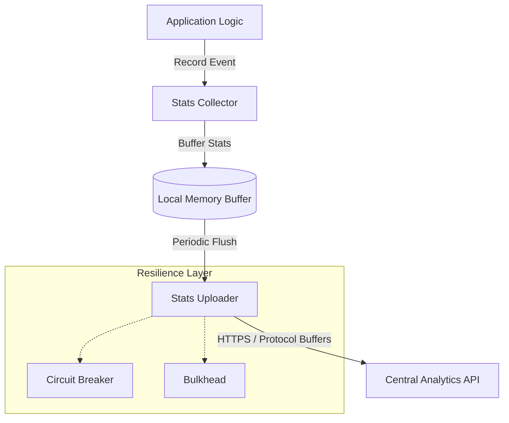

# 📊 Analytics Module

> **Real-time Client Statistics & Performance Monitoring.**

The Analytics module provides high-performance, resilient statistics collection and upload capabilities. It is designed to gather performance metrics and security details from client binaries and securely transmit them to the central analytics engine.

---

## 🏗️ Architecture Overview



---

## 🧩 Sub-Modules

| Module | Description |
| :--- | :--- |
| [**📥 Collector**](./collector/README.md) | In-memory aggregation and filtering of statistics. |
| [**📄 Types**](./types/README.md) | Domain models for analytics payloads and security metadata. |
| [**📤 Uploader**](./uploader/README.md) | Resilient transmission logic with retry and circuit breaking. |

---

## 🚀 Quick Start

```rust
use analytics::LocalStatsCollector;
use std::sync::Arc;
use std::time::Duration;

let collector = Arc::new(LocalStatsCollector::new(Duration::from_secs(60)));

// Record an event
collector.record_hit("home_feed", Duration::from_millis(45)).await;
```

---

[🏠 Hub](../../docs/HUB.md) |  [🔝 Top](#-analytics-module)
