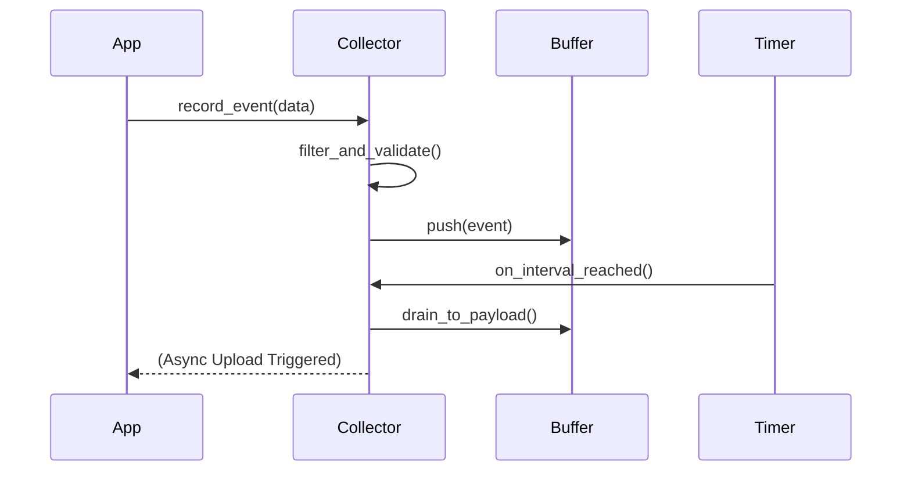

# 📥 Analytics: Collector

The `collector` module is the primary entry point for recording system events. It manages an efficient in-memory buffer to aggregate statistics before they are dispatched for upload.

---

## 🛠️ Collection Flow

---

## 🔑 Key Features

- **High Concurrency**: Thread-safe aggregation using atomic operations where possible.
- **Efficient Buffering**: Minimizes lock contention to avoid impacting the application's hot path.
- **Deduplication**: Automatically merges identical rapid-fire events to reduce payload size.

---
[⬅️ Back to Analytics Main](../README.md)
