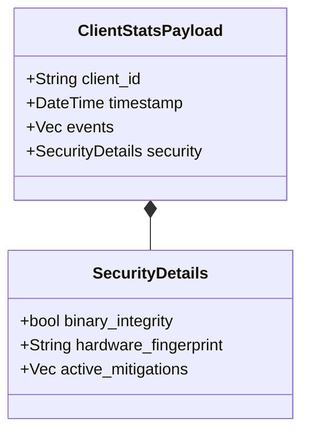

# 📄 Analytics: Types

The `types` module defines the data structures used throughout the analytics pipeline. These models ensure a consistent schema between the collector, uploader, and the central API.

---

## 🏗️ Data Model

---

## 🔑 Key Features

- **Strict Typing**: Ensures all required fields are present and correctly formatted.
- **Serialization**: Optimized for both JSON and binary formats (e.g., MessagePack or Protobuf).
- **Security Context**: Includes hardware and binary integrity metadata in every payload.

---

[🏠 Hub](../../../docs/HUB.md)  | [📊  Back to Analytics Main](../README.md) |  [🔝 Top](#-analytics-types)
