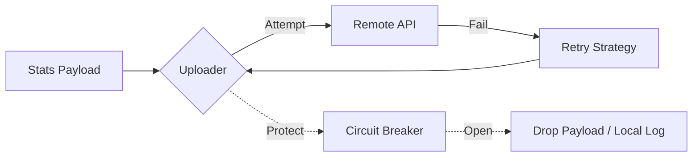

# 📤 Analytics: Uploader

The `uploader` module handles the transmission of aggregated statistics to the remote analytics server. It incorporates resilience patterns to ensure that statistics are delivered without degrading the host application's performance.

---

## 🛠️ Transmission Logic

---

## 🔑 Key Features

- **Circuit Breaking**: Prevents the application from stalling on network timeouts.
- **Backoff & Retry**: Intelligent retry logic with exponential backoff.
- **Bulkhead Isolation**: Ensures analytics traffic does not exhaust global HTTP connection pools.

---

[🏠 Hub](../../../docs/HUB.md)  | [📊  Back to Analytics Main](../README.md) |  [🔝 Top](#-analytics-uploader)
