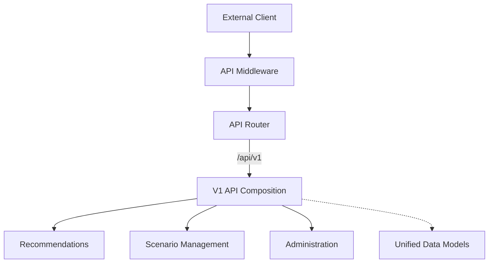

# 🌐 API Layer Module

> **High-Performance, versioned API composition for Recommendation Services.**

The API module acts as the entry point for all external requests. It is built on the `axum` framework and provides a versioned, secure, and resilient interface to the BONGAS-AI engine.

---

## 🏗️ Architecture Overview



---

## 🧩 Sub-Modules

| Module | Description |
| :--- | :--- |
| [**🚀 Router**](./router/README.md) | Central construction of the application router. |
| [**🛡️ Middleware**](./middleware/README.md) | API-specific request/response interceptors. |
| [**📡 V1**](./v1/README.md) | Version 1 specific route handlers and domains. |
| [**🧬 Models**](./models/README.md) | Shared request/response data structures. |

---

## 🚀 Quick Start

```rust
let router = api::create_router(engine, config, redis, metrics, cb_registry, start_time);

let listener = tokio::net::TcpListener::bind("0.0.0.0:8080").await?;
axum::serve(listener, router).await?;
```

---
[🏠 Back to Project Root](../../README.md)
