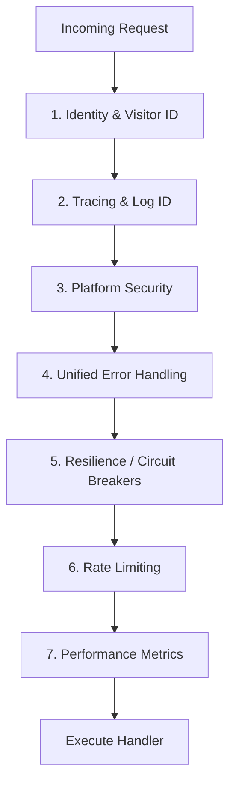

# 🛡️ API: Middleware

Handles cross-cutting concerns like identity, authentication, logging, and resilience for the Bongas-AI Symphony.

[🏠 Hub](../../../docs/HUB.md) | [🏗️ Architecture](../../../docs/architecture/SYMPHONY.md) | [👤 Identity](../../../docs/architecture/IDENTITY.md)

---

## 🏗️ The Symphony Middleware Stack

Middleware is applied in a specific order to ensure that identity context and request IDs are available to all inner layers.

### 👤 Identity Extraction (Zero-Touch)

The `identity_middleware` is the entry point for device recognition. It extracts:

- **`device_hash`**: A deterministic SHA-256 fingerprint (IP + UA).
- **`visitor_id`**: A transparent HTTP cookie for long-term persistence.
- **`ip_address`**: Client IP for regional targeting.

This context is injected into request extensions as `IdentityContext` and merged into the handler's parameters.

### ⚡ Resilience & Fault Tolerance

We leverage the `circuit_breaker` module to ensure that failing sub-services or slow ML models do not crash the content stream. Every request is wrapped in a **Resilience Layer** that handles timeouts and graceful degradation.

---

[🏠 Hub](../../../docs/HUB.md) | [🔝 Top](#️-api-middleware)
