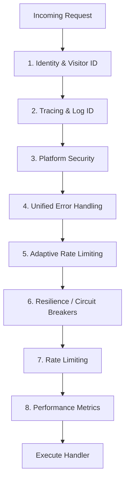

# 🛡️ API: Middleware

Handles cross-cutting concerns like identity, authentication, logging, and resilience for the Bongas-AI Symphony.

[🏠 Hub](../../../docs/HUB.md) | [🏗️ Architecture](../../../docs/architecture/SYMPHONY.md) | [👤 Identity](../../../docs/architecture/IDENTITY.md)

---

## 🏗️ The Symphony Middleware Stack

Middleware is applied in a specific order to ensure that identity context and request IDs are available to all inner layers.

### 👤 Identity Extraction (Zero-Touch)

The `identity_middleware` is the entry point for device recognition. It extracts:

- **`device_hash`**: A deterministic SHA-256 fingerprint (IP + UA).
- **`device_type`**: Automatically detected from User-Agent or `x-device-type` header.
- **`visitor_id`**: A transparent HTTP cookie for long-term persistence.
- **`ip_address`**: Client IP for regional targeting.

### 🛡️ Adaptive Rate Limiting

Protects the high-throughput SSE pool by tracking concurrent connections per `visitor_id`. This prevents resource exhaustion from bot attacks or device malfunctions.

---

[🏠 Hub](../../../docs/HUB.md)  | [🔌  Back to API Main](../README.md) |  [🔝 Top](#️-api-middleware)
