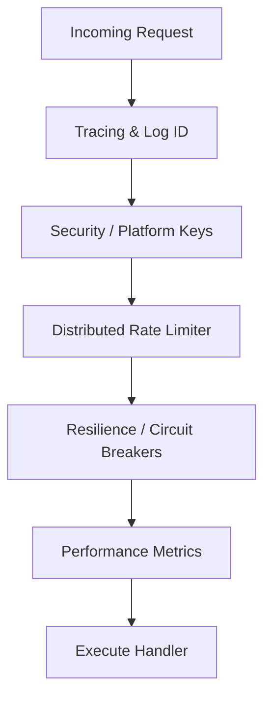

# 🛡️ API: Middleware

Handles cross-cutting concerns like authentication, logging, and rate limiting specifically for the API surface.

---

## 🏗️ Middleware Stack

---
[⬅️ Back to API Main](../README.md)
