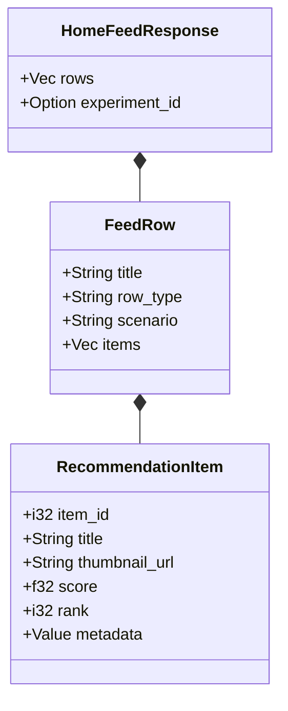

# 🎯 API Models: Recommendation

Defines the core data structures for content delivery. These models are optimized for serialization and final presentation on client devices.

---

## 🏗️ Structure

---
[⬅️ Back to Models Main](../README.md)
