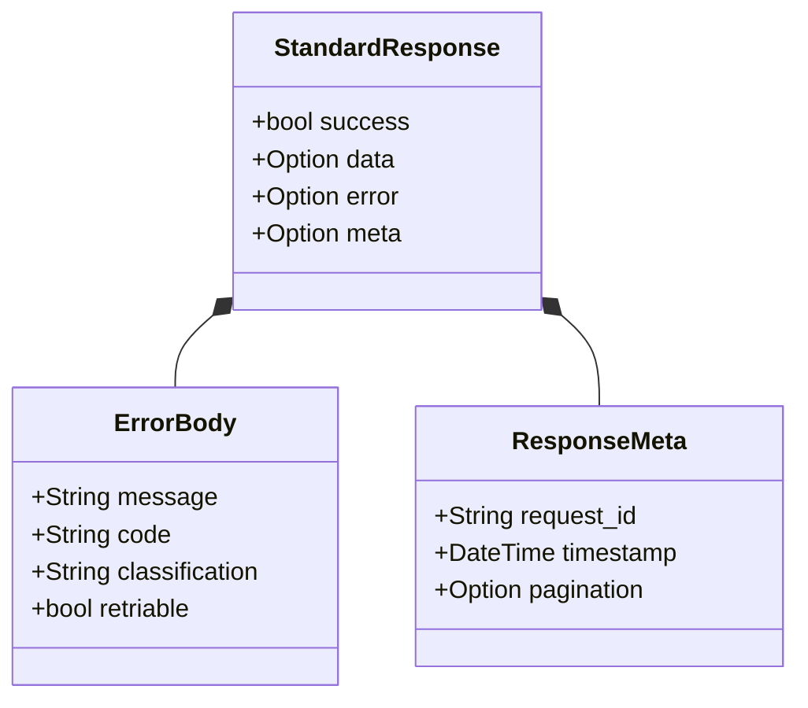

# 🧬 API Models: Response

Defines the standard envelope for all API communications. Every endpoint returns a `StandardResponse` to ensure consistent error handling and metadata tracking for client applications.

---

## 🏗️ Envelope Structure

---
[⬅️ Back to Models Main](../README.md)
