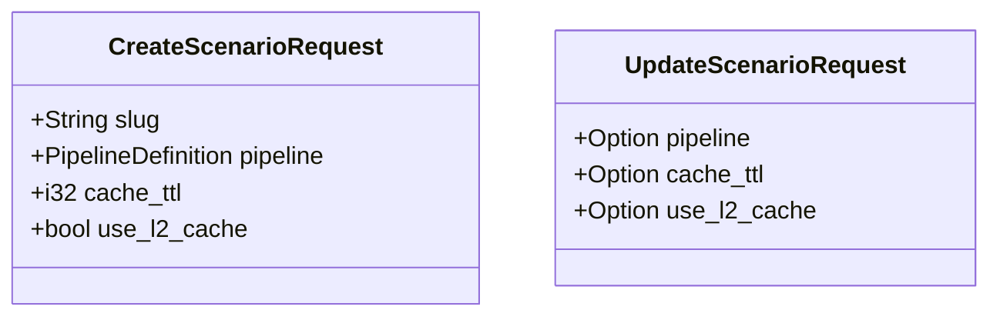

# 🎬 API Models: Scenario

Request payloads for managing recommendation scenarios. These models handle the input validation for creating and updating dynamic pipelines.

---

## 🏗️ Structure

---
[⬅️ Back to Models Main](../README.md)
