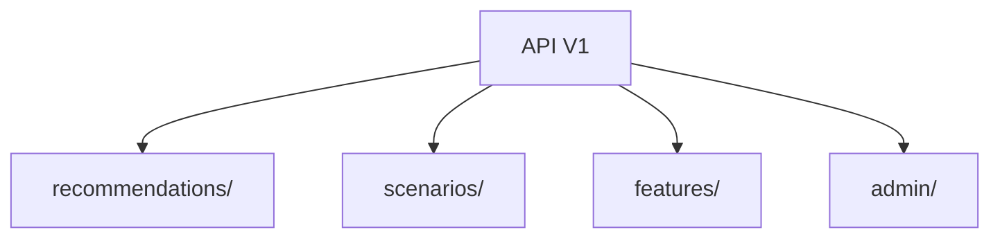

# 📡 API: Version 1

The primary implementation of the current API. Version 1 is optimized for high-throughput recommendation delivery and supports dynamic scenario hot-reloading.

---

## 🏗️ Domain Layout

---

[🏠 Hub](../../../docs/HUB.md)  | [🔌  Back to API Main](../README.md) | [🔝 Top](#-api-version-1)
