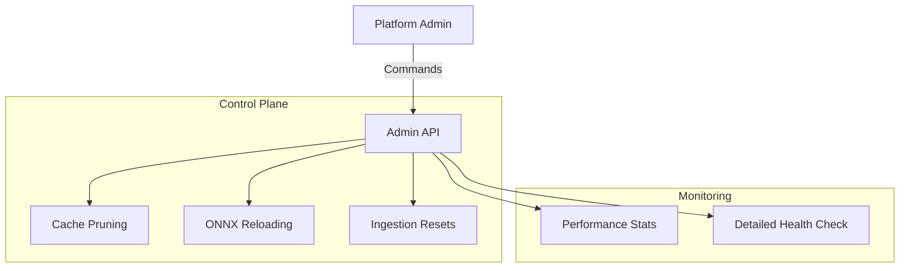

# 🛠️ API V1: Admin

System-level control and monitoring. Provides deep visibility into the engine's internal state, cache performance, and subsystem health.

---

## 🏗️ Administration Surface

---
[⬅️ Back to V1 Main](../README.md)
