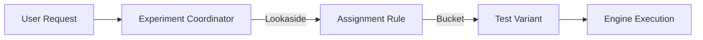

# 🧪 API V1: Experiments

Interfaces for A/B testing and feature flagging. Enables the dynamic assignment of users to different recommendation variants for performance evaluation.

---

## 🏗️ Experiment Assignment

---
[⬅️ Back to V1 Main](../README.md)
