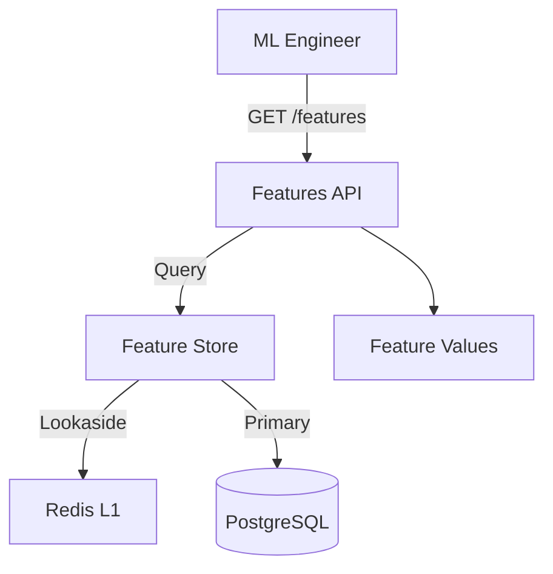

# 💎 API V1: Features

Provides introspection into the Feature Store. Enables developers and ML engineers to query available features and their current values for specific items or users.

---

## 🏗️ Feature Query Flow

---
[⬅️ Back to V1 Main](../README.md)
