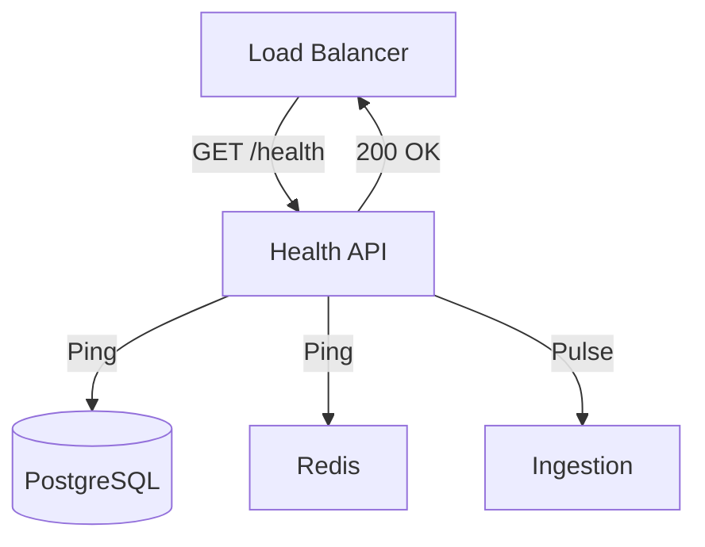

# 🏥 API V1: Health

Endpoints for load balancer probes and deep system health checks. Provides a quick way to verify that the service and all its dependencies are operational.

---

## 🏗️ Health Check Flow

---
[⬅️ Back to V1 Main](../README.md)
