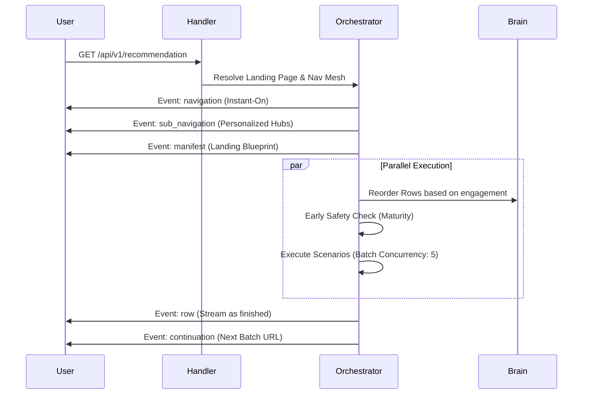

# 🎯 API V1: Recommendation Symphony

The primary surface for delivering the Bongas-AI Symphony. This module orchestrates the **Server-Driven UI (SDUI)** flow through a unified streaming gateway.

[🏠 Hub](../../../../docs/HUB.md) | [🏗️ Architecture](../../../../docs/architecture/SYMPHONY.md) | [🎨 Smart Pages](../../../../docs/architecture/PAGES.md)

---

## 🏗️ The Genesis Flow

The client app enters the Symphony through a single root endpoint that resolves the entire application structure and initial content.

## 🔑 Key Symphony Features

- **The Genesis Gateway**: One root call to rule them all. No hardcoded home slugs.
- **Batch-Streaming**: Protects client memory by streaming rows in server-dictated batches.
- **Continuation Pattern**: Seamlessly handles deep-scrolling via `continuation` events.
- **Adaptive Resilience**: Integrated fallback logic and visitor-level rate limiting.

---

[🏠 Hub](../../../../docs/HUB.md) | [🔝 Top](#-api-v1-recommendation-symphony)
