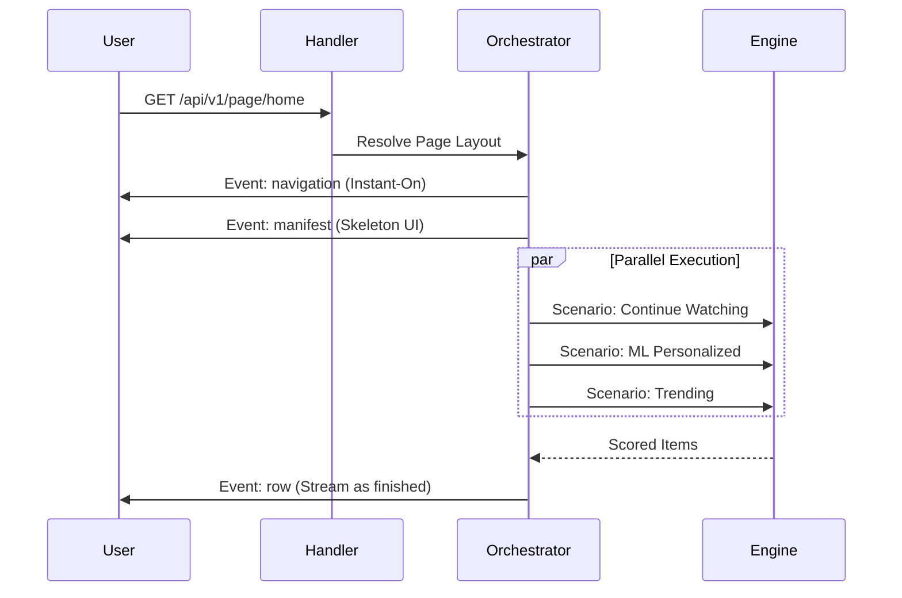

# 🎯 API V1: Recommendation Symphony

The primary surface for delivering the Bongas-AI Symphony. This module orchestrates the **Server-Driven UI (SDUI)** flow through streaming content delivery.

[🏠 Hub](../../../../docs/HUB.md) | [🏗️ Architecture](../../../../docs/architecture/SYMPHONY.md) | [⚡ Streaming](../../../../docs/architecture/ORCHESTRATION.md)

---

## 🏗️ The Unified Page Flow

We have moved from static, single-purpose endpoints to a unified, streaming contract centered on the `/page/{slug}` router.

## 🔑 Key Symphony Features

- **Instant-On Navigation**: Delivers the app's navigation bar and metadata in the first 50ms of a single connection.
- **Parallel Execution**: Executes multiple scenarios in parallel, streaming results as they finish to mask ML latency.
- **Contextual Intelligence**: Every recommendation is enriched with `IdentityContext` (Visitor ID, Device Hash, IP).
- **Graceful Degradation**: If a single scenario fails or times out, the stream continues, ensuring a resilient user experience.

---

[🏠 Hub](../../../../docs/HUB.md) | [🔝 Top](#-api-v1-recommendation-symphony)
