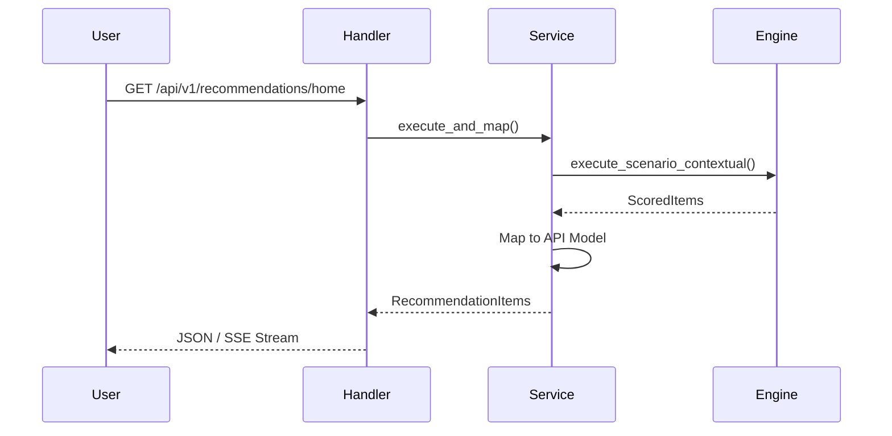

# 🎯 API V1: Recommendations

The primary surface for delivering personalized content. This module orchestrates engine execution, mapping, impression tracking, and background pre-warming.

---

## 🏗️ Recommendation Flow

---

## 🔑 Key Features

- **SSE Streaming**: Real-time delivery of home feed rows for "Instant-On" perceived performance.
- **Impression Tracking**: Automatic, asynchronous ingestion of shown items for ML loop feedback.
- **Predictive Warming**: Triggers background cache warming for subsequent pages/offsets.

---
[⬅️ Back to V1 Main](../README.md)
