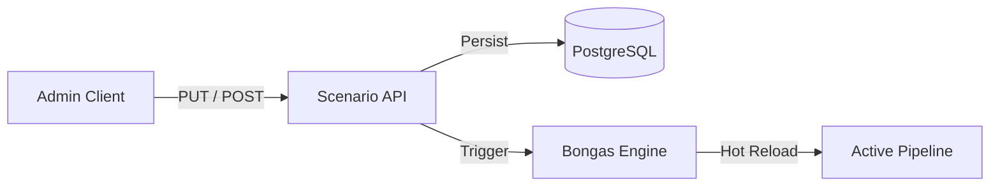

# 🎬 API V1: Scenarios

Management endpoints for dynamic recommendation scenarios. Allows for hot-reloading pipeline logic and adjusting orchestration rules without service restarts.

---

## 🏗️ Scenario Lifecycle

---

## 🔑 Key Features

- **Hot Reload**: Instant application of changed pipeline definitions.
- **Bulk Operations**: Reload all scenarios or specific subsets via slugs.
- **Admin Security**: Protected by mandatory `X-Platform-Key` validation.

---
[⬅️ Back to V1 Main](../README.md)
