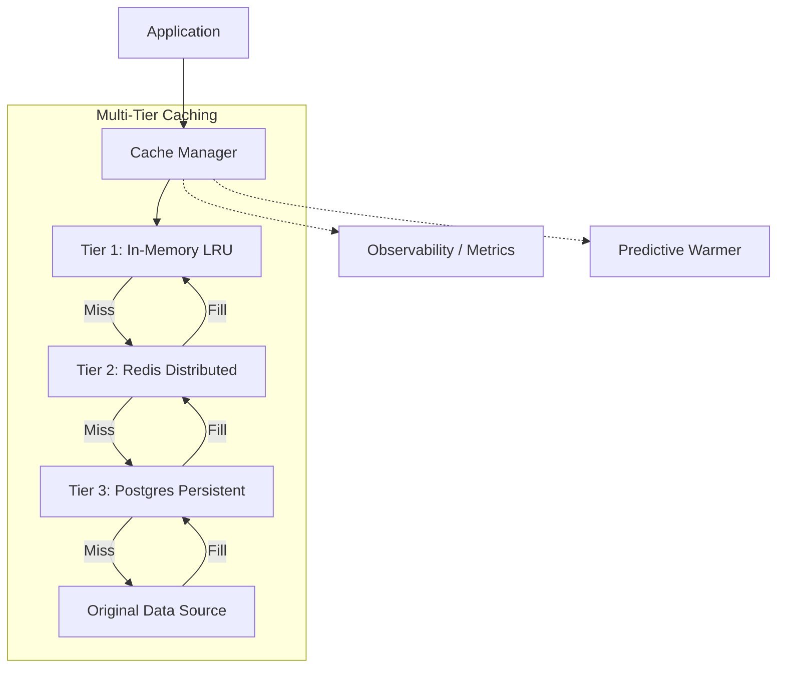

# 🗄️ Multi-Tier Cache Module

> **High-Performance caching infrastructure with multi-tier resilience.**

The Cache module provides a robust, Netflix-grade caching system designed to handle high-throughput recommendation traffic. It implements a **3-tier strategy** (L1/L2/L3) to minimize latency and protect backend data sources with coordinated invalidation.

---

## 🏗️ Architecture Overview



---

## 🧩 Cache Tiers

| Tier | Technology | Purpose | Coordination |
| :--- | :--- | :--- | :--- |
| **L1** | In-Memory (LRU) | Sub-microsecond local access. | Automatic backfill from L2/L3. |
| **L2** | Redis | Microsecond shared access across nodes. | Primary invalidation target. |
| **L3** | PostgreSQL | Millisecond system-of-record. | Atomic consistency. |

---

## 🧩 Sub-Modules

| Module | Description |
| :--- | :--- |
| [**⚙️ Config**](./config/README.md) | Cache settings, TTLs, and tier enablement. |
| [**🔥 Hot Registry**](./hot_registry/README.md) | Rapid access to trending/popular items. |
| [**🏢 Manager**](./manager/README.md) | Orchestrator for multi-tier lookup and backfill. |
| [**📊 Metrics**](./metrics/README.md) | Real-time hit/miss and latency tracking. |
| [**🛠️ Strategies**](./strategies/README.md) | Specific implementations (LRU, Redis, SQL, NoOp). |
| [**🧬 Traits**](./traits/README.md) | Core caching interfaces and tier definitions. |
| [**☀️ Warming**](./warming/README.md) | Predictive cache pre-loading mechanisms. |

---

## 🚀 Quick Start

```rust
use cache::{CacheManager, CacheConfig};

// The manager orchestrates L1 (LRU), L2 (Redis), and L3 (Postgres)
// Coordination is handled automatically on set/delete operations.
let manager = CacheManager::new(l1, l2, l3);

// Transparent 3-tier lookup
let result: Option<MyData> = manager.get("user:123").await?;
```

---

[🏠 Hub](../../docs/HUB.md) | [🔝 Top](#️-multi-tier-cache-module)
