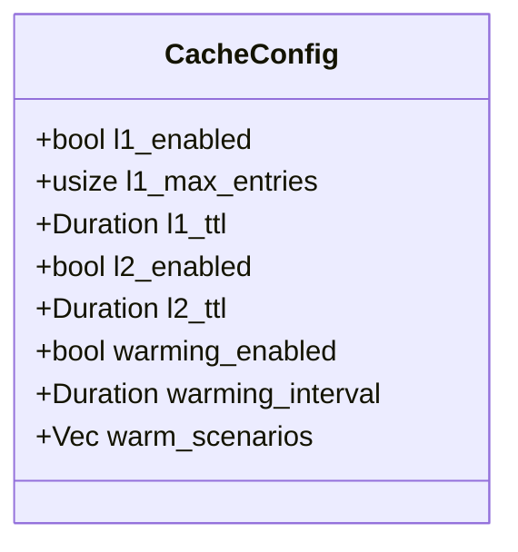

# ⚙️ Cache: Configuration

Defines the behavior and limits of each caching tier, including TTLs, max entries, and background warming schedules.

---

## 🛠️ Data Model

---

[🏠 Hub](../../../docs/HUB.md) | [🗄️ Back to Cache Main](../README.md) | [🔝 Top](#️-cache-configuration)
