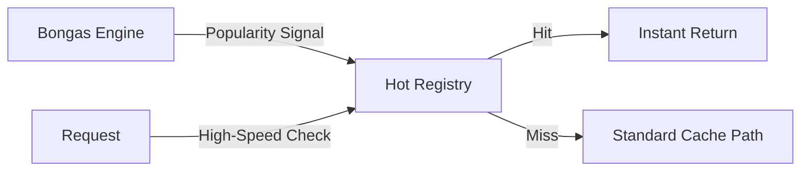

# 🔥 Cache: Hot Registry

A highly-optimized, read-heavy registry for the application's most popular content. It acts as a "Fast Path" for items that bypass standard LRU/Redis lookups due to their extreme popularity.

---

## 🏗️ Design Pattern

---
[⬅️ Back to Cache Main](../README.md)
