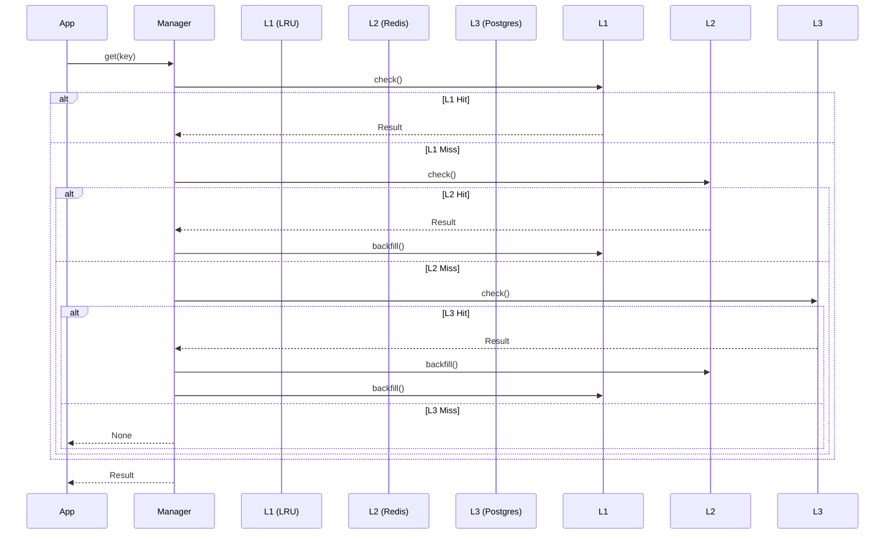

# 🏢 Cache: Manager

The central orchestrator of the caching system. It provides a unified API for the rest of the application, hiding the complexity of 3-tier lookups and backfilling.

---

## 🛠️ Execution Flow

---

[🏠 Hub](../../../docs/HUB.md) | [🗄️ Back to Cache Main](../README.md) | [🔝 Top](#-cache-manager)
