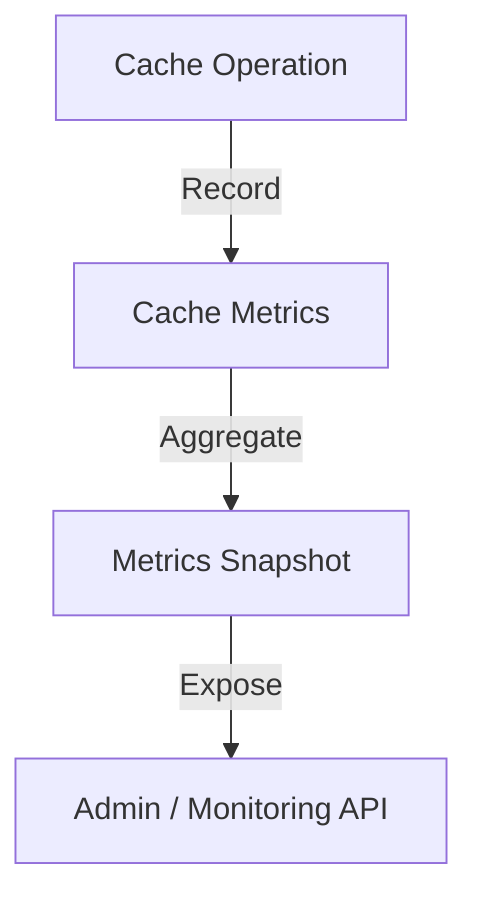

# 📊 Cache: Metrics

Real-time observability into cache performance. Tracks hit rates, miss rates, and latencies across all tiers.

---

## 🏗️ Observability Model

---
[⬅️ Back to Cache Main](../README.md)
