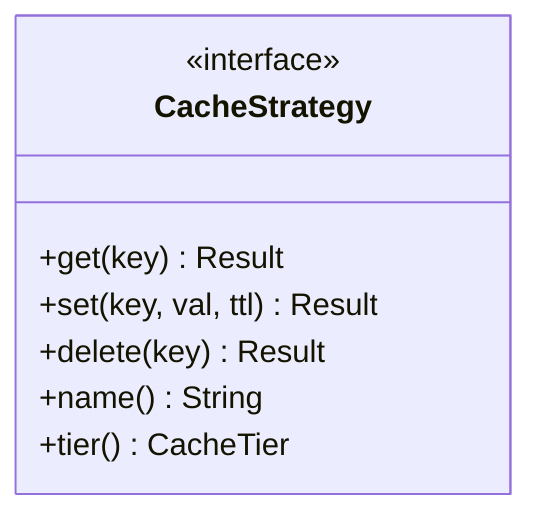

# 🧬 Cache: Traits

The foundational abstractions for the caching system. Defines how any storage backend should behave to be compatible with the `CacheManager`.

---

## 🏗️ Interface Definition

---

[🏠 Hub](../../../docs/HUB.md) | [🗄️ Back to Cache Main](../README.md) | [🔝 Top](#-cache-traits)
