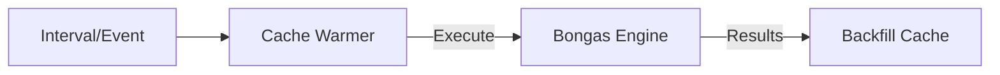

# ☀️ Cache: Warming

Proactively populates the cache with high-probability data to eliminate "Cold Start" latency for end-users.

---

## 🏗️ Warming Cycle

---

[🏠 Hub](../../../docs/HUB.md) | [🗄️ Back to Cache Main](../README.md) | [🔝 Top](#️-cache-warming)
