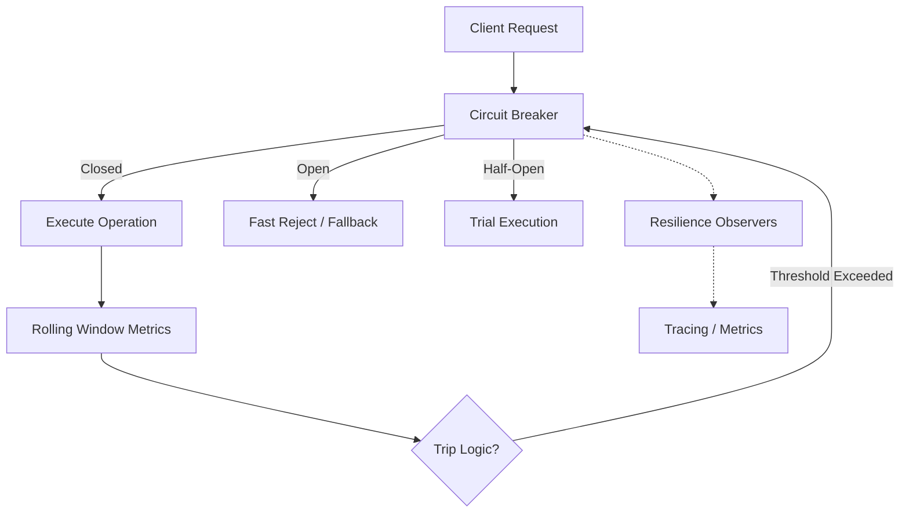

# 🛡️ Circuit Breaker Module

> **Resilience & Fault Tolerance for High-Performance Recommendation Engines.**

The Circuit Breaker module provides a production-grade implementation of the Circuit Breaker pattern, inspired by Netflix Hystrix. It prevents cascading failures by "tripping" when a service or dependency becomes unhealthy, allowing the system to fail fast and recover gracefully.

---

## 🏗️ Architecture Overview



---

## 🧩 Sub-Modules

| Module | Description |
| :--- | :--- |
| [**⚡ Breaker**](./breaker/README.md) | The core orchestrator and public execution API. |
| [**⚙️ Config**](./config/README.md) | Fluent builders and strict validation for breaker settings. |
| [**📡 Observer**](./observer/README.md) | Event-driven telemetry and monitoring hooks. |
| [**🗃️ Registry**](./registry/README.md) | Centralized management and lifecycle of breaker instances. |
| [**📊 Rolling Window**](./rolling_window/README.md) | High-performance, bucketed metrics for failure tracking. |
| [**🔄 State**](./state/README.md) | Atomic state machine for Closed, Open, and Half-Open transitions. |

---

## 🚀 Quick Start

```rust
use circuit_breaker::{CircuitBreaker, CircuitBreakerConfig, CircuitBreakerId};

let config = CircuitBreakerConfig::builder()
    .failure_rate_threshold(0.5)
    .minimum_calls(10)
    .build()?;

let breaker = CircuitBreaker::new(
    CircuitBreakerId::new("recommendation-engine"),
    config,
    Arc::new(TracingObserver),
);

let result = breaker.call(|| async {
    fetch_recommendations().await
}).await;
```

---
[🏠 Back to Project Root](../../README.md)
