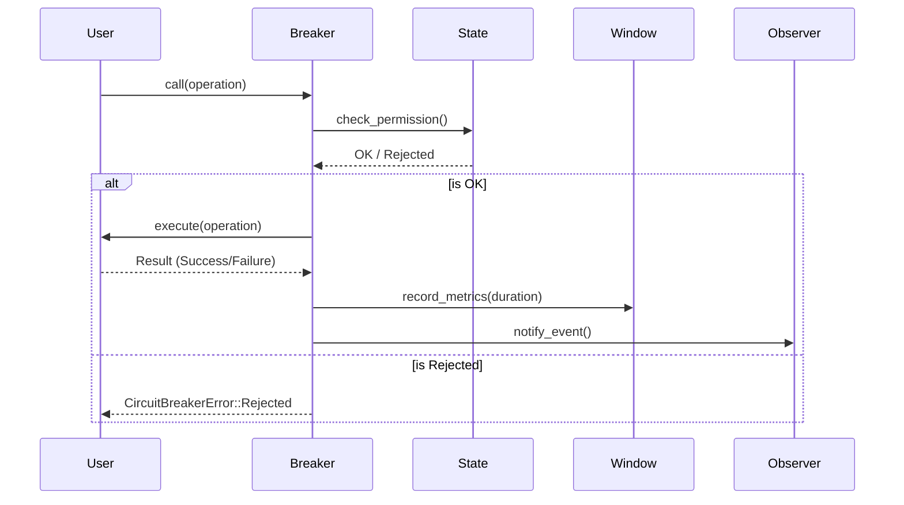

# ⚡ Circuit Breaker: Core Execution

The `breaker` sub-module houses the central orchestrator that users interact with. It manages the lifecycle of a single protected operation, coordinating between state, metrics, and observers.

---

## 🛠️ Responsibility Layer

---

## 🔑 Key Features

- **Thundering Herd Protection**: Integration with request consolidation.
- **Bulkhead Pattern**: Built-in semaphore-based concurrency limiting.
- **Async First**: Designed for native `tokio` integration.
- **Fast Path**: Optimized state checks with minimal lock contention.

---
[⬅️ Back to Circuit Breaker Main](../README.md)
