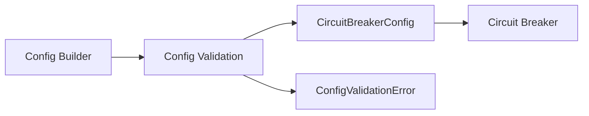

# ⚙️ Circuit Breaker: Configuration

The `config` module provides a fluent and type-safe way to define circuit breaker behavior, ensuring all parameters are validated before a breaker is instantiated.

---

## 🛠️ Configuration Pattern

---

## 🔑 Key Features

- **Fluent API**: Builder pattern for human-readable configuration.
- **Strict Validation**: Prevents zero window durations or invalid thresholds.
- **Hystrix Defaults**: Pre-configured with industry-standard resilience settings.
- **Cross-Field Checks**: Validates dependencies between parameters (e.g., slow call duration vs. call timeout).

---

[🏠 Hub](../../../docs/HUB.md) | [🛡️ Back to Circuit Breaker Main](../README.md) | [🔝 Top](#️-circuit-breaker-configuration)
