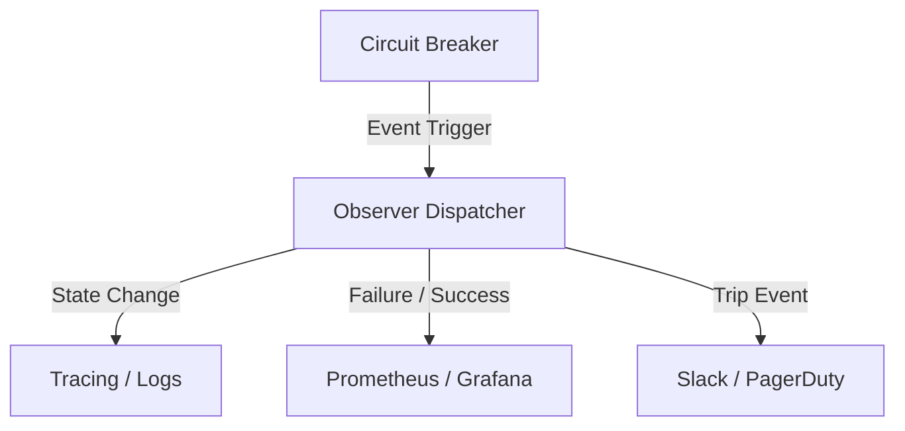

# 📡 Circuit Breaker: Observer

The `observer` module implements the Observer Pattern to provide real-time visibility into the health and status of protected operations.

---

## 🏗️ Telemetry Flow

---

## 🔑 Key Features

- **Pluggable Architecture**: Implement the `ResilienceObserver` trait to add new sinks.
- **Event Richness**: Tracks state changes, metrics resets, slow calls, and rejections.
- **Composite Support**: Use `CompositeObserver` to broadcast events to multiple listeners.

---

[🏠 Hub](../../../docs/HUB.md) | [🛡️ Back to Circuit Breaker Main](../README.md) | [🔝 Top](#-circuit-breaker-observer)
