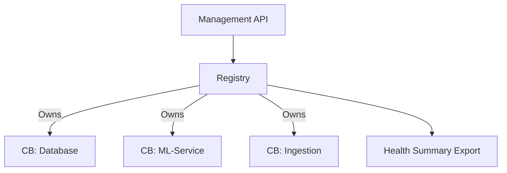

# 🗃️ Circuit Breaker: Registry

The `registry` module acts as a central repository for managing all circuit breakers within the application. It ensures that breakers are shared correctly and provides a unified point for health monitoring.

---

## 🛠️ Management Layer

---

## 🔑 Key Features

- **Lifecycle Management**: Safely create and retrieve shared breakers using `Arc`.
- **Health Aggregation**: Generate summaries of the status of all breakers for administrative dashboards.
- **Thread Safety**: Backed by high-concurrency data structures for safe cross-thread access.

---
[⬅️ Back to Circuit Breaker Main](../README.md)
