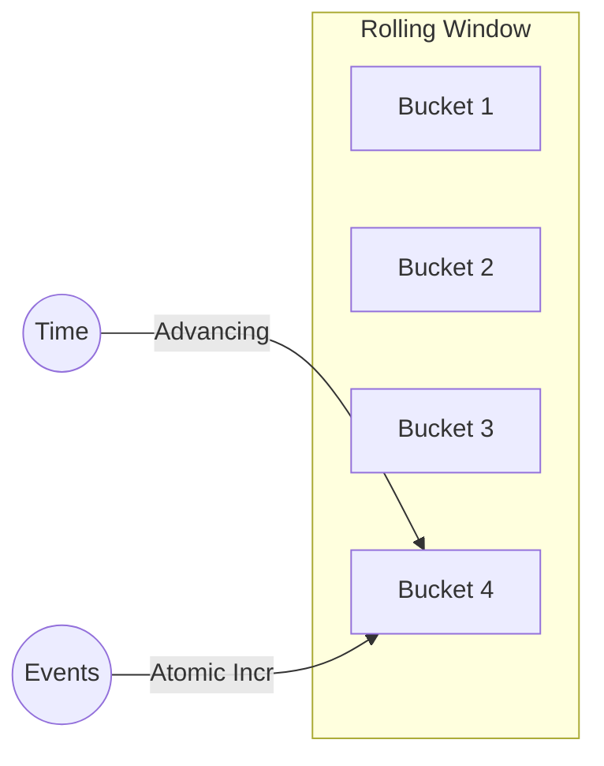

# 📊 Circuit Breaker: Rolling Window

The `rolling_window` module provides a high-performance, bucketed metric storage system. It is responsible for tracking successes, failures, and latencies over a sliding time window.

---

## 🏗️ Metrics Design

---

## 🔑 Key Features

- **Lock-Free Operation**: Uses atomic counters for zero-contention metrics updates.
- **Configurable Precision**: Adjustable window duration and bucket count.
- **Snapshot Support**: Provides immutable snapshots of metrics for decision-making without blocking writers.

---

[🏠 Hub](../../../docs/HUB.md) | [🛡️ Back to Circuit Breaker Main](../README.md) | [🔝 Top](#-circuit-breaker-rolling-window)
