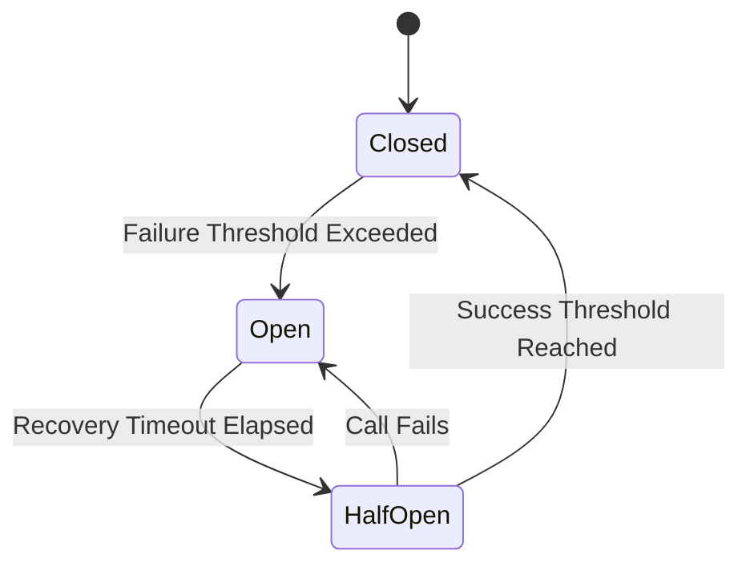

# 🔄 Circuit Breaker: State Machine

The `state` module implements the core finite state machine (FSM) for the circuit breaker. It manages the transitions between `Closed`, `Open`, and `HalfOpen` states using atomic operations.

---

## 🛠️ State Transitions

---

## 🔑 Key Features

- **Atomic Transitions**: Uses Compare-and-Swap (CAS) logic to prevent race conditions during state changes.
- **Recovery Tracking**: Manages precise timers for the transition from Open to Half-Open.
- **Probe Management**: Tracks the number of successful trial calls in the Half-Open state.

---
[⬅️ Back to Circuit Breaker Main](../README.md)
