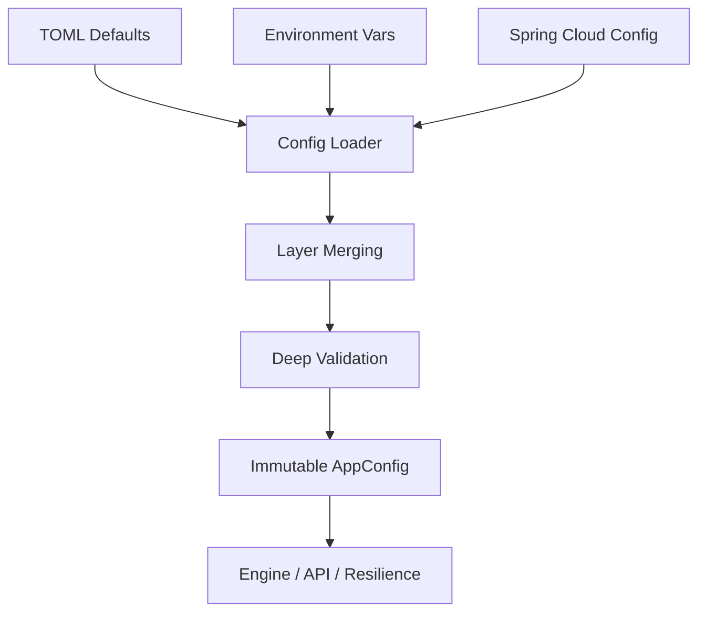

# ⚙️ Configuration Module

> **Layered, immutable, and validated configuration backbone.**

The Configuration module implements the Netflix-grade Composite Configuration Pattern. It provides a robust system for loading, merging, and validating application settings from multiple sources with a strict precedence hierarchy.

---

## 🏗️ Architecture Overview



---

## 🏗️ AppConfig Structure

The root `AppConfig` struct is a composite of specialized module configurations:

| Component | Description | Key Focus |
| :--- | :--- | :--- |
| **Server** | Axum host/port/env. | Web Infrastructure |
| **Database** | Postgres pool & timeouts. | Relational Storage |
| **Redis** | Connection & pool settings. | Distributed Cache |
| **ClickHouse** | OLAP connection parameters. | Analytics Sink |
| **Ingestion** | Kafka topics & source configs. | Data Retrieval |
| **Security** | API keys, Licenses, Anti-Debug. | System Protection |
| **ML** | ONNX threads, Feature store. | Inference Engine |
| **Pipeline** | Concurrency & Sample rates. | Execution Logic |
| **Cache** | Multi-tier TTLs & Warming. | Performance |
| **Resilience** | CB thresholds & Retry logic. | Fault Tolerance |
| **Observability** | OTLP, Jaeger, Metrics. | Visibility |
| **Experiments** | A/B test assignment methods. | Logic Branching |
| **Hive Mind** | Global intelligence linking. | Remote Strategy |
| **Notifications** | Resend, Kafka, Polling settings. | Outbound Engagement |

---

## 🧩 Sub-Modules

| Module | Description |
| :--- | :--- |
| [**📥 Loader**](./loader/README.md) | Orchestrator for the layered loading process. |
| [**📡 Sources**](./sources/README.md) | Pluggable backends (TOML, Env, Spring Cloud). |
| [**🧬 Types**](./types/README.md) | Strongly-typed configuration models. |
| [**🛡️ Validation**](./validation/README.md) | Cross-module dependency and constraint checking. |
| [**🌐 HTTP**](./http/README.md) | Web server specific settings (CORS, Compression). |

---

## 🚀 Quick Start

```rust
use config::ConfigLoader;

let config = ConfigLoader::new()
    .with_defaults()
    .with_env()
    .load()?;

println!("Server running on port: {}", config.server.port);
```

---

[🏠 Hub](../../docs/HUB.md) | [🔝 Top](#️-configuration-module)
