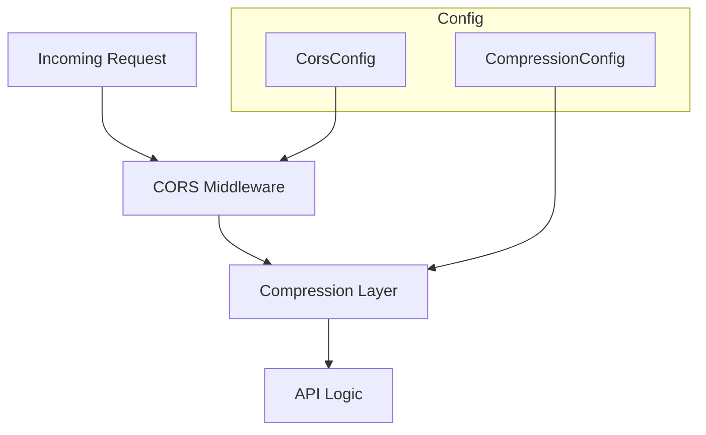

# 🌐 Configuration: HTTP

> **Server-side transport and security settings.**

The `http` module defines the configuration for the web server layer, focusing on transport-level optimizations like compression and security policies like CORS.

---

## 🏗️ Architecture Overview

---

## 🔑 Key Features

- **CORS Management**: Fine-grained control over allowed origins, methods, and headers.
- **Payload Compression**: Configurable Gzip/Zstd levels to optimize bandwidth.
- **Security Headers**: Standardized transport-level security settings.

---
[⬅️ Back to Config Main](../README.md)
