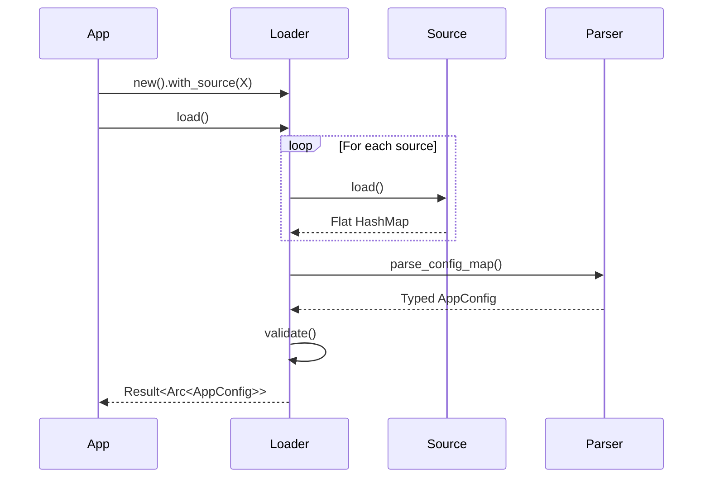

# 📥 Configuration: Loader

The `loader` sub-module is the entry point for the configuration system. It implements the Builder pattern to define layers and orchestrates the merging of multiple sources into a single, cohesive `AppConfig`.

---

## 🛠️ Loading Pipeline

---

[🏠 Hub](../../../docs/HUB.md) | [⚙️ Back to Config Main](../README.md) | [🔝 Top](#-configuration-loader)
