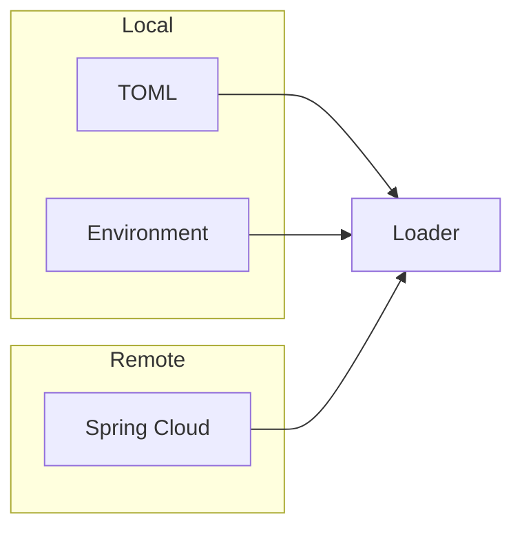

# 📡 Configuration: Sources

Adapters for various configuration storage backends. Each source implements the `ConfigSource` trait and returns a flat, dot-separated map of string keys and values.

---

## 🏗️ Source Strategy

---

[🏠 Hub](../../../docs/HUB.md) | [⚙️ Back to Config Main](../README.md) | [🔝 Top](#-configuration-sources)
