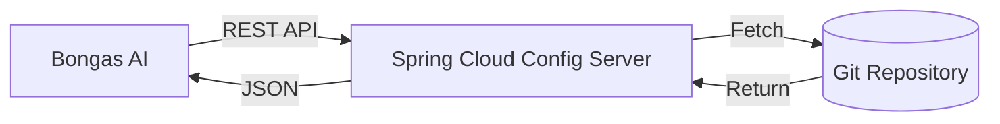

# ☁️ Config Source: Spring Cloud

Integrates with a remote Spring Cloud Config Server to enable centralized configuration management across distributed microservices.

---

## 🏗️ Remote Flow

---

## 🔑 Key Features

- **Dynamic Updates**: Supports fetching the latest configuration without application restarts.
- **Profile Support**: Automatically handles different environments (e.g., `prod`, `staging`, `dev`).
- **Labeling**: Enables versioning through Git branches or tags.

---

[🏠 Hub](../../../../docs/HUB.md) | [📡 Back to Sources Main](../README.md) | [🔝 Top](#️-config-source-spring-cloud)
